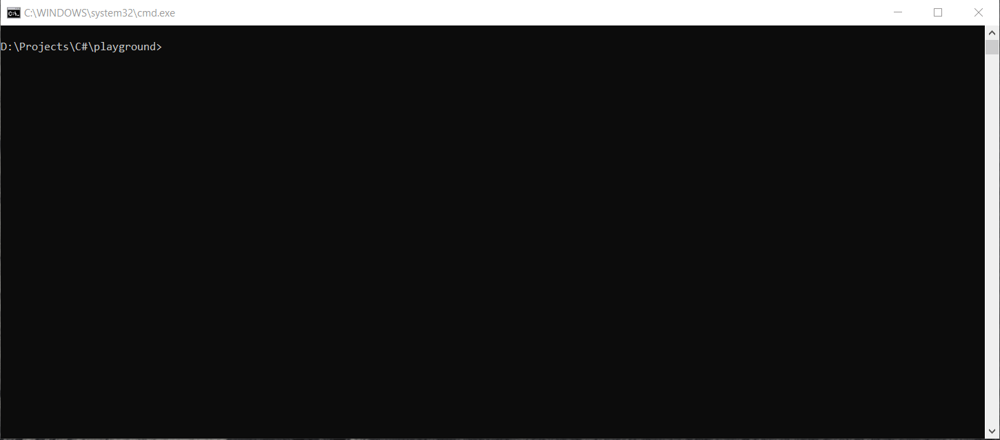

# altv-py-updater
A small script written in Python to download alt:V server files easily

# Requirements
In order to make the script functional, you need to install some dependencies that is comes with the requirements.txt
If you have `pip` installed its easy, just run the following command first:
```python
pip install -r requirements.txt
```
After the installation is done, you are ready to use the script as you like.

# Usage
The following command will download data files (pedmodels, vehmodels, vehmods, clothes), server binary, config file and all the modules that are supported in alt:V (C#, JS and JSByte) to a folder called `test`:
```
altv-updater.py --output_dir ./test --modules coreclr js jsbyte --data --config
```

The script is very easy to use, all the options are listed in the help menu:
```python
altv-updater.py --help
```

```
usage: altv-updater.py [-h] [-p {x64_win32,x64_linux}] [-b {dev,rc,release}] [-m {coreclr,js,jsbyte} [{coreclr,js,jsbyte} ...]] [-ss] [-d] [-e] [-vs] [-c]
                       [--output_dir OUTPUT_DIR]

A small script that helps updating alt:V server

optional arguments:
  -h, --help            show this help message and exit
  -p {x64_win32,x64_linux}, --platform {x64_win32,x64_linux}
                        select which platform to download, windows or linux
  -b {dev,rc,release}, --branch {dev,rc,release}
                        select which branch to use
  -m {coreclr,js,jsbyte} [{coreclr,js,jsbyte} ...], --modules {coreclr,js,jsbyte} [{coreclr,js,jsbyte} ...]
                        download modules for the server, possible values are: coreclr, js, jsbyte
  -ss, --skip_server    skip download server binary file
  -d, --data            download server datas such as vehmods, vehbins, pedmodels, etc)
  -e, --example         download example resources to the server
  -vs, --voice_server   download voice server
  -c, --config          download basic config file
  --output_dir OUTPUT_DIR
                        output directory which the script will download the files to (default is the current directory)
```

# Demo
